# YNAB Off-Target Assignment Analysis - System Architecture

**Version:** 1.0
**Last Updated:** June 2025
**Status:** Production Ready

## Architecture Overview

The YNAB Off-Target Assignment Analysis application follows a modern web application architecture using Next.js with a focus on client-side data processing and secure API integration.

## High-Level Architecture

### System Components

1. **Frontend Application (Next.js)**
   - React-based user interface
   - Client-side data processing
   - Responsive design with Tailwind CSS
   - Local state management

2. **YNAB API Integration Layer**
   - HTTP client for YNAB API
   - Authentication handling
   - Rate limiting management
   - Response caching

3. **Data Processing Engine**
   - Category analysis algorithms
   - Target alignment calculations
   - Currency conversion utilities
   - Data transformation logic

4. **Security Layer**
   - Environment variable management
   - Token storage and validation
   - Error handling and logging

## System Architecture Diagram

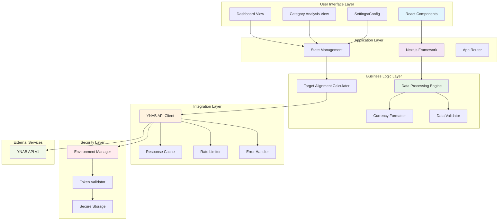

## Data Flow Architecture

### Primary Data Flow

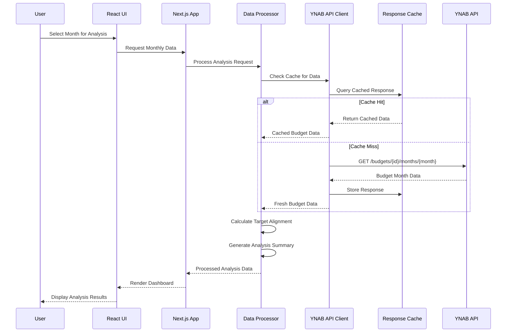

### Authentication Flow

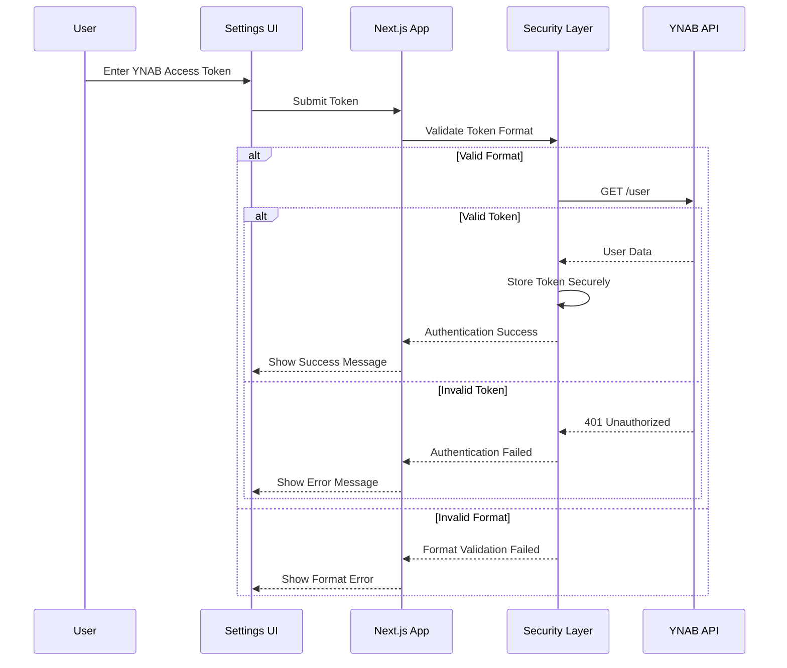

## Component Architecture

### Frontend Component Hierarchy

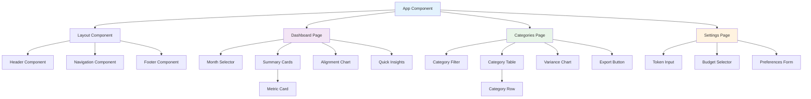

### API Integration Architecture

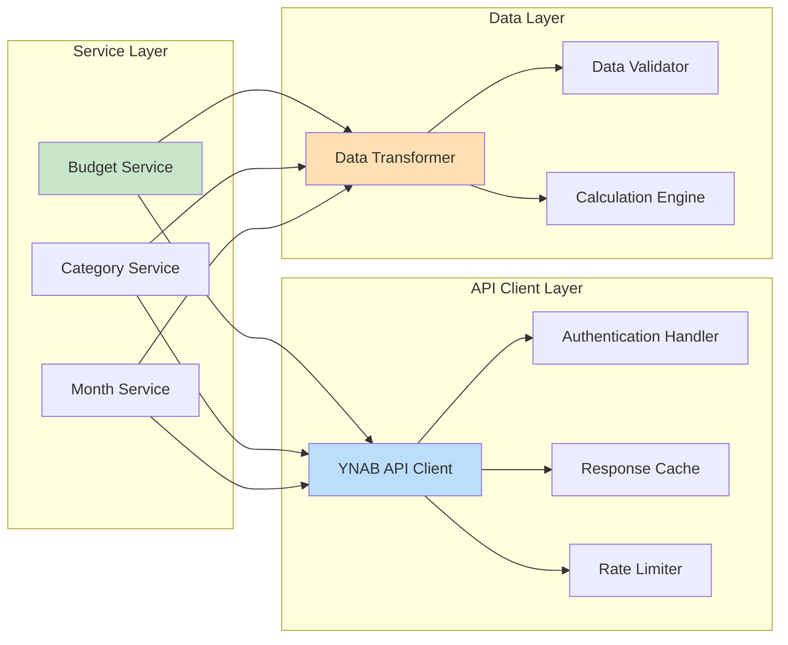

## Technology Stack Architecture

### Development Stack

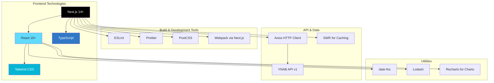

## Security Architecture

### Security Layers and Controls

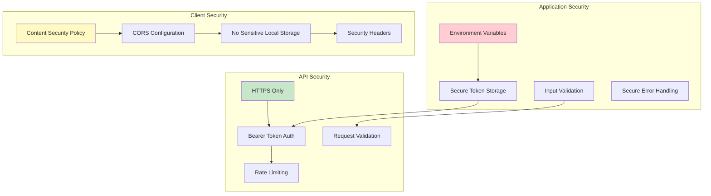

## Deployment Architecture

### Local Development Setup

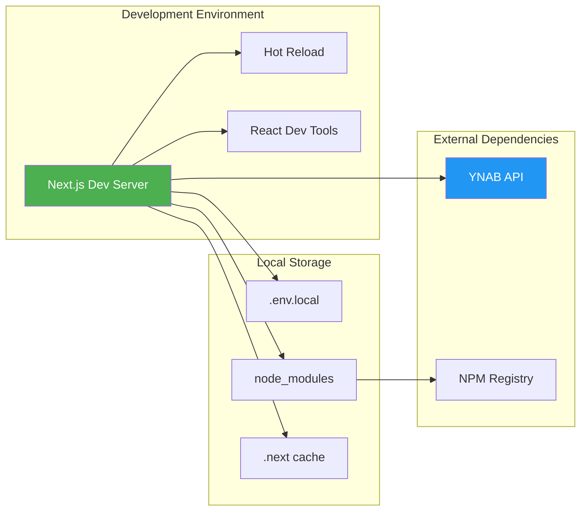

## Performance Architecture

### Optimization Strategies

1. **Client-Side Optimization**
   - Component lazy loading
   - Memoization of expensive calculations
   - Virtual scrolling for large lists
   - Image optimization

2. **API Optimization**
   - Response caching with TTL
   - Request deduplication
   - Delta requests when available
   - Batch processing

3. **Data Processing Optimization**
   - Efficient algorithms for calculations
   - Minimal data transformation
   - Streaming for large datasets
   - Worker threads for heavy processing

### Caching Strategy

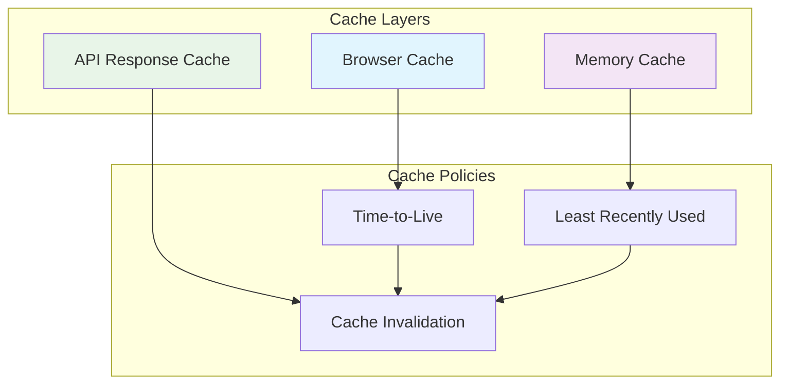

## Current Implementation Data Flow

### Core Metrics Calculation Architecture

The application implements a sophisticated calculation engine for analyzing budget target alignment:

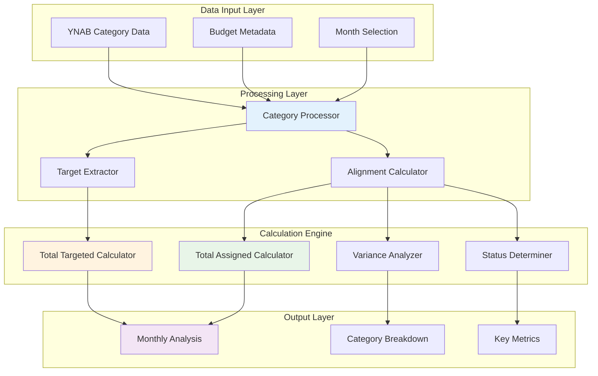

### Month Selection and Validation Architecture

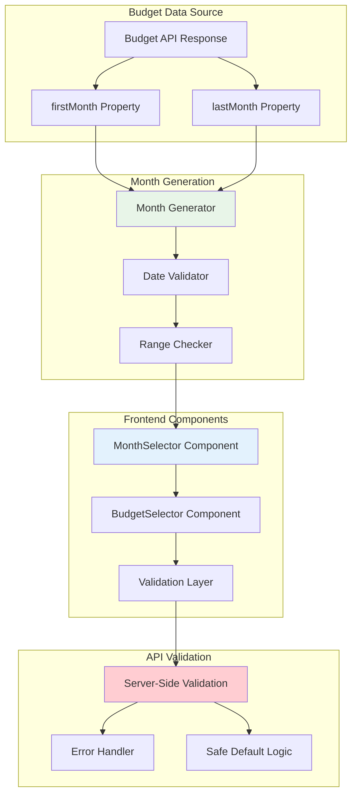

### Property Name Compatibility Layer

The system handles both camelCase (frontend) and snake_case (backend) property naming:

```typescript
// Compatibility layer implementation
const firstMonth = budget.firstMonth || budget.first_month;
const lastMonth = budget.lastMonth || budget.last_month;
```

**Key Implementation Files:**
- `src/lib/monthly-analysis.ts`: Core calculation engine
- `src/lib/data-processing.ts`: Utility functions and date handling
- `src/components/MonthSelector.tsx`: Frontend month selection
- `src/app/api/analysis/monthly/route.ts`: Server-side validation

This system architecture provides a robust, scalable, and secure foundation for the YNAB Off-Target Assignment Analysis application while maintaining simplicity for local development and deployment.
